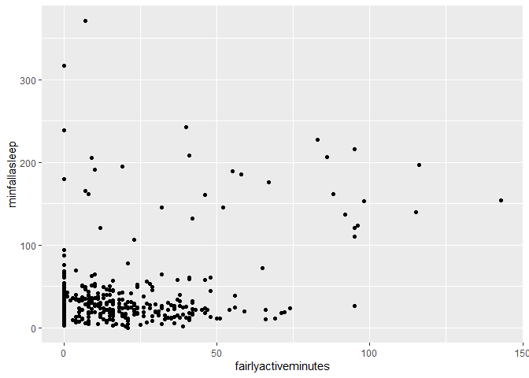

BellaBeats Case Study
================
Kelsey Fleming
2022-08-04

## Introduction and Business Question

Welcome to my BellBeats case study as part of the Google Data Analytics
Professional Certificate. I’ve been tasked with analyzing smart device
usage data in order to gain insight on consumer behaviour which can be
applied to the BellaBeats business strategy.

## Ask Phase

1.  What are some trends in smart device usage?

-   What metrics are users tracking?

2.  How could these trends apply to Bellabeat customers?

-   Market a specific metric more heavily than others

3.  How could these trends help influence Bellabeat marketing strategy?

-   Allocate marketing funds to the metrics users care about
-   Allow stakeholders to invest in R&D based on how similar devices are
    used

Business Task: **Analyze available data on similar products to discover
trends in usage in order to develop an efficient marketing strategy**

## Prepare Phase

The dataset I am using is FitBit Fitness Tracker Data found on Kaggle.
The data is open source and stored in 18 CSV files. Data can be found
here: @https://www.kaggle.com/datasets/arashnic/fitbit

## Process Phase

I am viewing and cleaning the data using R. First, I need to load the
necessary packages

``` r
library(tidyverse)
```

    ## ── Attaching packages ─────────────────────────────────────── tidyverse 1.3.1 ──

    ## ✔ ggplot2 3.3.6     ✔ purrr   0.3.4
    ## ✔ tibble  3.1.7     ✔ dplyr   1.0.9
    ## ✔ tidyr   1.2.0     ✔ stringr 1.4.0
    ## ✔ readr   2.1.2     ✔ forcats 0.5.1

    ## ── Conflicts ────────────────────────────────────────── tidyverse_conflicts() ──
    ## ✖ dplyr::filter() masks stats::filter()
    ## ✖ dplyr::lag()    masks stats::lag()

``` r
library(lubridate)
```

    ## 
    ## Attaching package: 'lubridate'

    ## The following objects are masked from 'package:base':
    ## 
    ##     date, intersect, setdiff, union

``` r
library(janitor)
```

    ## 
    ## Attaching package: 'janitor'

    ## The following objects are masked from 'package:stats':
    ## 
    ##     chisq.test, fisher.test

Importing and renaming the data sets of interest

``` r
dailyActivity <- read_csv("dailyActivity_merged.csv")
```

    ## Rows: 940 Columns: 15
    ## ── Column specification ────────────────────────────────────────────────────────
    ## Delimiter: ","
    ## chr  (1): ActivityDate
    ## dbl (14): Id, TotalSteps, TotalDistance, TrackerDistance, LoggedActivitiesDi...
    ## 
    ## ℹ Use `spec()` to retrieve the full column specification for this data.
    ## ℹ Specify the column types or set `show_col_types = FALSE` to quiet this message.

``` r
dailyIntens <- read_csv("dailyIntensities_merged.csv")
```

    ## Rows: 940 Columns: 10
    ## ── Column specification ────────────────────────────────────────────────────────
    ## Delimiter: ","
    ## chr (1): ActivityDay
    ## dbl (9): Id, SedentaryMinutes, LightlyActiveMinutes, FairlyActiveMinutes, Ve...
    ## 
    ## ℹ Use `spec()` to retrieve the full column specification for this data.
    ## ℹ Specify the column types or set `show_col_types = FALSE` to quiet this message.

``` r
dailySleep <- read_csv("sleepDay_merged.csv")
```

    ## Rows: 413 Columns: 5
    ## ── Column specification ────────────────────────────────────────────────────────
    ## Delimiter: ","
    ## chr (1): SleepDay
    ## dbl (4): Id, TotalSleepRecords, TotalMinutesAsleep, TotalTimeInBed
    ## 
    ## ℹ Use `spec()` to retrieve the full column specification for this data.
    ## ℹ Specify the column types or set `show_col_types = FALSE` to quiet this message.

``` r
weightLog <- read_csv("weightLogInfo_merged.csv")
```

    ## Rows: 67 Columns: 8
    ## ── Column specification ────────────────────────────────────────────────────────
    ## Delimiter: ","
    ## chr (1): Date
    ## dbl (6): Id, WeightKg, WeightPounds, Fat, BMI, LogId
    ## lgl (1): IsManualReport
    ## 
    ## ℹ Use `spec()` to retrieve the full column specification for this data.
    ## ℹ Specify the column types or set `show_col_types = FALSE` to quiet this message.

Previewing the data sets

``` r
head(dailyActivity)
```

    ## # A tibble: 6 × 15
    ##        Id ActivityDate TotalSteps TotalDistance TrackerDistance LoggedActivitie…
    ##     <dbl> <chr>             <dbl>         <dbl>           <dbl>            <dbl>
    ## 1  1.50e9 4/12/2016         13162          8.5             8.5                 0
    ## 2  1.50e9 4/13/2016         10735          6.97            6.97                0
    ## 3  1.50e9 4/14/2016         10460          6.74            6.74                0
    ## 4  1.50e9 4/15/2016          9762          6.28            6.28                0
    ## 5  1.50e9 4/16/2016         12669          8.16            8.16                0
    ## 6  1.50e9 4/17/2016          9705          6.48            6.48                0
    ## # … with 9 more variables: VeryActiveDistance <dbl>,
    ## #   ModeratelyActiveDistance <dbl>, LightActiveDistance <dbl>,
    ## #   SedentaryActiveDistance <dbl>, VeryActiveMinutes <dbl>,
    ## #   FairlyActiveMinutes <dbl>, LightlyActiveMinutes <dbl>,
    ## #   SedentaryMinutes <dbl>, Calories <dbl>

``` r
head(dailyIntens)
```

    ## # A tibble: 6 × 10
    ##           Id ActivityDay SedentaryMinutes LightlyActiveMinutes FairlyActiveMinu…
    ##        <dbl> <chr>                  <dbl>                <dbl>             <dbl>
    ## 1 1503960366 4/12/2016                728                  328                13
    ## 2 1503960366 4/13/2016                776                  217                19
    ## 3 1503960366 4/14/2016               1218                  181                11
    ## 4 1503960366 4/15/2016                726                  209                34
    ## 5 1503960366 4/16/2016                773                  221                10
    ## 6 1503960366 4/17/2016                539                  164                20
    ## # … with 5 more variables: VeryActiveMinutes <dbl>,
    ## #   SedentaryActiveDistance <dbl>, LightActiveDistance <dbl>,
    ## #   ModeratelyActiveDistance <dbl>, VeryActiveDistance <dbl>

This set has the same data as dailyActivity so I will not use it

``` r
head(dailySleep)
```

    ## # A tibble: 6 × 5
    ##           Id SleepDay           TotalSleepRecor… TotalMinutesAsl… TotalTimeInBed
    ##        <dbl> <chr>                         <dbl>            <dbl>          <dbl>
    ## 1 1503960366 4/12/2016 12:00:0…                1              327            346
    ## 2 1503960366 4/13/2016 12:00:0…                2              384            407
    ## 3 1503960366 4/15/2016 12:00:0…                1              412            442
    ## 4 1503960366 4/16/2016 12:00:0…                2              340            367
    ## 5 1503960366 4/17/2016 12:00:0…                1              700            712
    ## 6 1503960366 4/19/2016 12:00:0…                1              304            320

This set uses a datetime format, this does not match the other sets so
we will need to deal with this in the cleaning phase

``` r
head(weightLog)
```

    ## # A tibble: 6 × 8
    ##           Id Date       WeightKg WeightPounds   Fat   BMI IsManualReport   LogId
    ##        <dbl> <chr>         <dbl>        <dbl> <dbl> <dbl> <lgl>            <dbl>
    ## 1 1503960366 5/2/2016 …     52.6         116.    22  22.6 TRUE           1.46e12
    ## 2 1503960366 5/3/2016 …     52.6         116.    NA  22.6 TRUE           1.46e12
    ## 3 1927972279 4/13/2016…    134.          294.    NA  47.5 FALSE          1.46e12
    ## 4 2873212765 4/21/2016…     56.7         125.    NA  21.5 TRUE           1.46e12
    ## 5 2873212765 5/12/2016…     57.3         126.    NA  21.7 TRUE           1.46e12
    ## 6 4319703577 4/17/2016…     72.4         160.    25  27.5 TRUE           1.46e12

Without knowing height, muscle mass, general health, not much to be
gained from this data. Not to mention, there are only 8 distinct users
logging data here:

``` r
n_distinct(weightLog$Id)
```

    ## [1] 8

\###We will move forward with the dailyActivity and dailySleep datasets

Let’s look at some summary statistics for each table

``` r
dailyActivity %>%
  select(VeryActiveMinutes, LightlyActiveMinutes, SedentaryMinutes, Calories) %>%
  summary()
```

    ##  VeryActiveMinutes LightlyActiveMinutes SedentaryMinutes    Calories   
    ##  Min.   :  0.00    Min.   :  0.0        Min.   :   0.0   Min.   :   0  
    ##  1st Qu.:  0.00    1st Qu.:127.0        1st Qu.: 729.8   1st Qu.:1828  
    ##  Median :  4.00    Median :199.0        Median :1057.5   Median :2134  
    ##  Mean   : 21.16    Mean   :192.8        Mean   : 991.2   Mean   :2304  
    ##  3rd Qu.: 32.00    3rd Qu.:264.0        3rd Qu.:1229.5   3rd Qu.:2793  
    ##  Max.   :210.00    Max.   :518.0        Max.   :1440.0   Max.   :4900

``` r
dailySleep %>%
  select(TotalMinutesAsleep, TotalTimeInBed) %>%
  summary()
```

    ##  TotalMinutesAsleep TotalTimeInBed 
    ##  Min.   : 58.0      Min.   : 61.0  
    ##  1st Qu.:361.0      1st Qu.:403.0  
    ##  Median :433.0      Median :463.0  
    ##  Mean   :419.5      Mean   :458.6  
    ##  3rd Qu.:490.0      3rd Qu.:526.0  
    ##  Max.   :796.0      Max.   :961.0

Can use this data to gain some insight into sleep quality as it is
affected by activity level

## Process Phase

In this phase I will clean the data sets so they can be merged

How many different users are in these data sets\>

``` r
n_distinct(dailyActivity$Id)
```

    ## [1] 33

``` r
n_distinct(dailySleep$Id)
```

    ## [1] 24

The number of unique users is relatively low. Generally we want n \> 30.
We will continue with analysis but should keep this in mind when
extracting insights.

Look for duplicates in the data and remove them

``` r
sum(duplicated(dailyActivity))
```

    ## [1] 0

``` r
sum(duplicated(dailySleep))
```

    ## [1] 3

``` r
dailySleep <- dailySleep %>%
  distinct() %>%
  drop_na()
```

And check again to make sure those were removed

``` r
sum(duplicated(dailySleep))
```

    ## [1] 0

Clean the column names to make merging easier

``` r
clean_names(dailyActivity)
```

    ## # A tibble: 940 × 15
    ##            id activity_date total_steps total_distance tracker_distance
    ##         <dbl> <chr>               <dbl>          <dbl>            <dbl>
    ##  1 1503960366 4/12/2016           13162           8.5              8.5 
    ##  2 1503960366 4/13/2016           10735           6.97             6.97
    ##  3 1503960366 4/14/2016           10460           6.74             6.74
    ##  4 1503960366 4/15/2016            9762           6.28             6.28
    ##  5 1503960366 4/16/2016           12669           8.16             8.16
    ##  6 1503960366 4/17/2016            9705           6.48             6.48
    ##  7 1503960366 4/18/2016           13019           8.59             8.59
    ##  8 1503960366 4/19/2016           15506           9.88             9.88
    ##  9 1503960366 4/20/2016           10544           6.68             6.68
    ## 10 1503960366 4/21/2016            9819           6.34             6.34
    ## # … with 930 more rows, and 10 more variables:
    ## #   logged_activities_distance <dbl>, very_active_distance <dbl>,
    ## #   moderately_active_distance <dbl>, light_active_distance <dbl>,
    ## #   sedentary_active_distance <dbl>, very_active_minutes <dbl>,
    ## #   fairly_active_minutes <dbl>, lightly_active_minutes <dbl>,
    ## #   sedentary_minutes <dbl>, calories <dbl>

``` r
dailyActivity <- rename_with(dailyActivity, tolower)

clean_names(dailySleep)
```

    ## # A tibble: 410 × 5
    ##            id sleep_day       total_sleep_rec… total_minutes_a… total_time_in_b…
    ##         <dbl> <chr>                      <dbl>            <dbl>            <dbl>
    ##  1 1503960366 4/12/2016 12:0…                1              327              346
    ##  2 1503960366 4/13/2016 12:0…                2              384              407
    ##  3 1503960366 4/15/2016 12:0…                1              412              442
    ##  4 1503960366 4/16/2016 12:0…                2              340              367
    ##  5 1503960366 4/17/2016 12:0…                1              700              712
    ##  6 1503960366 4/19/2016 12:0…                1              304              320
    ##  7 1503960366 4/20/2016 12:0…                1              360              377
    ##  8 1503960366 4/21/2016 12:0…                1              325              364
    ##  9 1503960366 4/23/2016 12:0…                1              361              384
    ## 10 1503960366 4/24/2016 12:0…                1              430              449
    ## # … with 400 more rows

``` r
dailySleep <- rename_with(dailySleep, tolower)
```

Create a consistent date format

``` r
dailyActivity <- dailyActivity %>% 
  rename(date = activitydate) %>%
  mutate(date = as_date(date, format = "%m/%d/%Y"))

dailySleep <- dailySleep %>%
  rename(date = sleepday) %>%
  mutate(date = as_date(date, format = "%m/%d/%Y %I:%M:%S %p"))
```

Now we can merge the data frames

``` r
DailyActivitySleep <- merge(dailyActivity, dailySleep, by = c("id", "date"))
head(DailyActivitySleep)
```

    ##           id       date totalsteps totaldistance trackerdistance
    ## 1 1503960366 2016-04-12      13162          8.50            8.50
    ## 2 1503960366 2016-04-13      10735          6.97            6.97
    ## 3 1503960366 2016-04-15       9762          6.28            6.28
    ## 4 1503960366 2016-04-16      12669          8.16            8.16
    ## 5 1503960366 2016-04-17       9705          6.48            6.48
    ## 6 1503960366 2016-04-19      15506          9.88            9.88
    ##   loggedactivitiesdistance veryactivedistance moderatelyactivedistance
    ## 1                        0               1.88                     0.55
    ## 2                        0               1.57                     0.69
    ## 3                        0               2.14                     1.26
    ## 4                        0               2.71                     0.41
    ## 5                        0               3.19                     0.78
    ## 6                        0               3.53                     1.32
    ##   lightactivedistance sedentaryactivedistance veryactiveminutes
    ## 1                6.06                       0                25
    ## 2                4.71                       0                21
    ## 3                2.83                       0                29
    ## 4                5.04                       0                36
    ## 5                2.51                       0                38
    ## 6                5.03                       0                50
    ##   fairlyactiveminutes lightlyactiveminutes sedentaryminutes calories
    ## 1                  13                  328              728     1985
    ## 2                  19                  217              776     1797
    ## 3                  34                  209              726     1745
    ## 4                  10                  221              773     1863
    ## 5                  20                  164              539     1728
    ## 6                  31                  264              775     2035
    ##   totalsleeprecords totalminutesasleep totaltimeinbed
    ## 1                 1                327            346
    ## 2                 2                384            407
    ## 3                 1                412            442
    ## 4                 2                340            367
    ## 5                 1                700            712
    ## 6                 1                304            320

## Analyze Phase

Want to mutate the data frame to calculate the time it takes to fall
asleep

``` r
DailyActivitySleep <- DailyActivitySleep %>%
  mutate(DailyActivitySleep, minfallasleep = totaltimeinbed - totalminutesasleep)
```

Seeing if sedentary minutes affects time to fall asleep

``` r
ggplot( data = DailyActivitySleep, aes( x = sedentaryminutes, y = minfallasleep)) + geom_point()
```

<!-- --> We can
see somewhat of a bell curve with some outliers

See if very active minutes affects time to fall asleep

``` r
ggplot( data = DailyActivitySleep, aes( x = veryactiveminutes, y = minfallasleep)) + geom_point()
```

<!-- --> We can
see a relationship where the more active you are the quicker you will
fall asleep

Let’s plot the other activity types

``` r
ggplot( data = DailyActivitySleep, aes( x = fairlyactiveminutes, y = minfallasleep)) + geom_point()
```

<!-- -->

``` r
ggplot( data = DailyActivitySleep, aes( x = lightlyactiveminutes, y = minfallasleep)) + geom_point()
```

<!-- -->

And finally let’s look at the relationship between calories burned and
time to fall asleep

``` r
ggplot( data = DailyActivitySleep, aes( x = calories, y = minfallasleep)) + geom_point()
```

<!-- -->

Exploring the Very Active vs Sleep relationship further, let’s look at
the total minutes asleep

``` r
ggplot( data = DailyActivitySleep, aes( x = veryactiveminutes, y = totalminutesasleep)) + geom_point()
```

<!-- -->

Not really seeing a relationship here

## Share and Act Phase

We were able to see a relationship between Very Active Minutes and the
time it takes to fall asleep where the more active you are in the day
(to a point) the more quickly you will fall asleep. Using this,
BellaBeats could recommend activity levels in order to optimize a users
sleep quality using their “Leaf” device along with the BellaBeats app.
